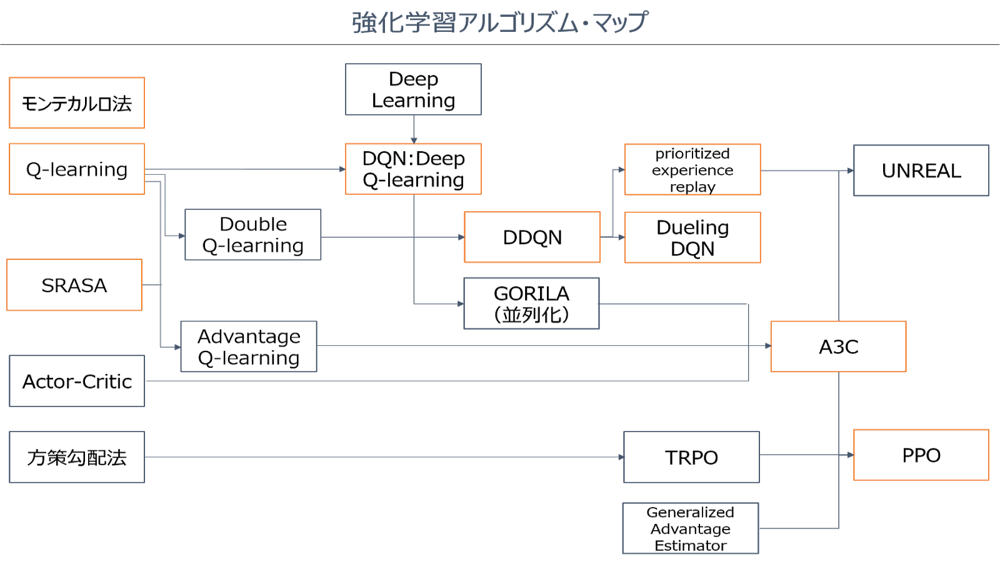
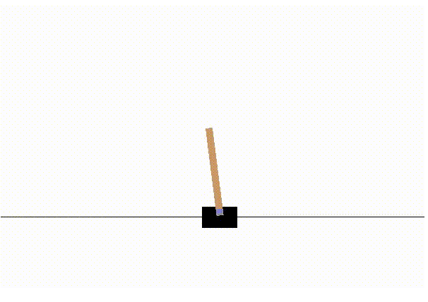
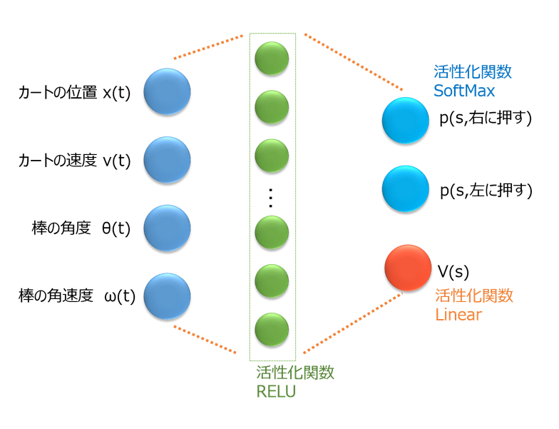

# 概要とか、アルゴリズムの流れとかについて
[この記事](https://qiita.com/sugulu/items/3c7d6cbe600d455e853b#_reference-1baa4d1b29ab02907d13)を自分なりに読んでメモしてる感じです。    
アルゴリズムの流れはこんな感じみたい


## 強化学習とは
機械学習の1分野。   
画像分類とかの教師あり学習とか、クラスタリングとかの教師なし学習とかとは少し違って、実際に達成したいゴールがある時に、そのゴールに辿りつけたか(近かったか)をベース(報酬)にどうしたらいいのかを学習していく。

実際に車を何度もシミュレーションや実車で走らせて、ぶつかった場合は改善し、ぶつからなかった場合はその制御手法を採用し、何度も試行錯誤しながら、ぶつからないというゴールを達成させるような学習手法が、強化学習。
強化学習は主に「何かの制御」や「対戦型ゲームのアルゴリズム」に使用されることが多い手法だ。最近は文書の生成に使われたりもするみたい。


これが代表的な強化学習の例題。

## 以下(時系列順の)アルゴリズムの流れ

### Q-Learning
Q-Learning（Q学習）は、最も代表的な手法。まずはこの手法から!

Q-LearningではQ関数と呼ばれる**行動価値関数**を学習し、制御を実現します。
行動価値関数Q(a|s)とは、状態s(t)のときに行動aを行ったときに、その先どれくらいの報酬がもらえそうかを出力する関数。    
Q関数を表すのには表を使っていて、表のサイズが、「状態sを離散化した数」×「行動の種類」となるみたい。   
棒の問題だと、右に押すときと、左に押す時の報酬の値をそれぞれ出力して、より大きい方を選択していく感じ。   
[実装](http://neuro-educator.com/rl1/)

### SARSA、モンテカルロ法
SARSAは大体Q学習と同じだけど、学習の方法がちょっと違うみたい。

モンテカルロ法はPoleが倒れるまで(終わりを迎えるまで)行動し、その行動履歴からQ関数を学習する手法。    
そこまで重要じゃないかも？余裕があれば。
[実装](https://qiita.com/sugulu/items/7a14117bbd3d926eb1f2)

### DQN、DDQN
Deep Learning(深層学習)の登場により複雑なゲームや制御問題の解決が可能になったもの。Deep Q-Learning Network。結構話題になった。深層強化学習とも。   
Q関数の表現にDeep Learningを使用。    
またDQNの学習で、2つのQ-networkを使用したDouble DQN（DDQN）もあるみたい。まあ実装してみてからかな。   
[実装](http://neuro-educator.com/rl2/)

### prioritized experience replayとDueling DQN
prioritized experience replayは、Q学習がまだ進んでいない状態s(t)の経験に対して、優先的に学習を実行させる手法らしい。余裕があれば   
[実装](https://qiita.com/sugulu/items/10ac7ce53de40d4c8891)

Dueling DQNは、Q関数を状態価値関数V(s)とAdvantage関数A(a|s)に分割して学習するネットワークを使用する手法。    
Q(a|s) = V(s) + A(a|s)    
となるらしい。どんな行動をする時もV(s)を学習するため、Q関数の学習が早く良くなる。余裕があればかな。    
[実装](https://qiita.com/sugulu/items/6c4d34446d4878cde61a)

### A3C
A3Cとは「Asynchronous Advantage Actor-Critic」の略称。現代(深層学習登場以後)はこれが主流というかベース？なのかな。   
A3Cは並列計算に加え、さらにAdvantageと呼ばれる報酬の計算方法を使用している。 Advantageは報酬の計算を1step後ではなく、数ステップ後まで行動を実施して行う計算手法。    
さらにA3Cには、Actor-Criticと呼ばれるネットワークが使用されている。

これは、Q関数ではなく、方策関数π(s)=[p(右), p(左)]で直接、状態sに応じた行動を出力する。   
p(右)は状態sで右に押すほうが良い確率を示す。この部分をActorと呼ぶ。    
さらに同時に、状態価値V(s)も学習させます。この部分をCriticと呼びます。

なるほど分からん。実装してみないと無理やね。    
[実装](https://qiita.com/sugulu/items/acbc909dd9b74b043e45)

### PPO
イケイケ感ある。流行り廃りがかなり早くて日進月歩なんだろうな。   
```
PPOは、openAIから2017年に発表された手法で、UNREALよりも実装が簡単です。

方策関数π(s)の更新手法として、TRPOが提案されていましたが、TRPOは実装がややこしく、またA3CのActor-Criticなど、出力が複数種類あるネットワークに適用できないという課題がありました。

この点を解決したのがPPOです。

PPOではClippingと呼ばれ、π(s) / π(s_old)が大きく変化した場合には、一定の値にしてしまう操作（Clip）を行います。

例えば、π(s_old)が0.1なのにπ(s)が0.9となった場合には、π(s) / π(s_old) = 9ではなく、1.2などにしてしまい、π(s) / π(s_old)が1.2以上は全部1.2としてしまう操作をします。

こうすることで、TRPOとは異なる手法で、方策関数π(s)の更新が大きく変化しすぎるのを防ぎます。
```
ふむ。ここまで追いかけるようなことするのかはかなり微妙かなあ。   
[実装](https://qiita.com/sugulu/items/8925d170f030878d6582)

### まとめ
最新のを追い続けるのが目的では無いので、A3Cあたりをとりあえずの目標にしてやっていこうかな。
